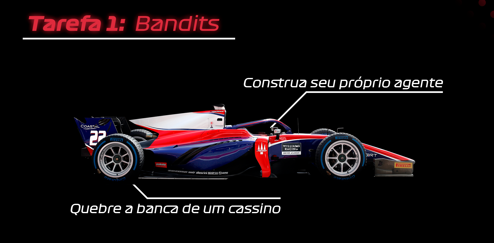
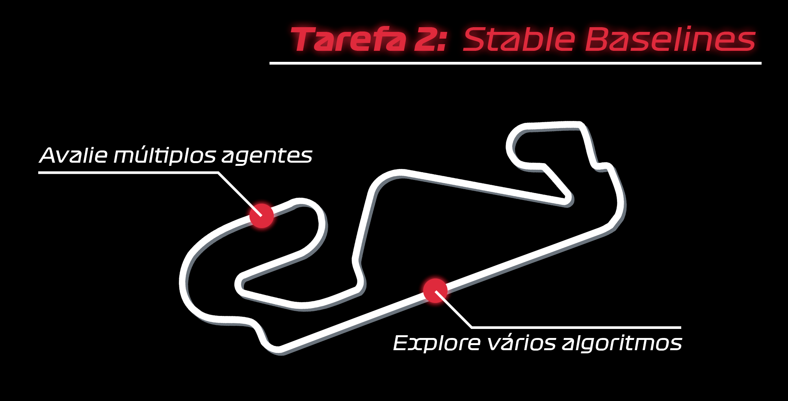
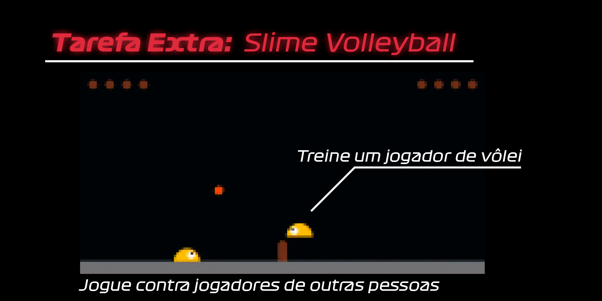

Boas vindas ao Projeto Trainee 2021 da área de Aprendizado por Reforço!

Antes de mais nada, recomendamos ler a seção de **[👩‍🏫 Introdução](https://github.com/turing-usp/Aprendizado-por-Reforco/tree/main/Introdu%C3%A7%C3%A3o)** do nosso Repositório de Aprendizado por Reforço para se familiarizar com os conceitos principais da área!

O projeto será dividido em duas partes:

Nessa primeira etapa do projeto, você construirá um agente simples de Aprendizado por Reforço para entender um pouco melhor os principais conceitos da área aplicados em algum tipo de código. Aqui, você aprenderá sobre o clássico problema dos *k*-Armed Bandits, como conseguir estimar valores para determinada ações com base na recompensa, como selecionar ações com esse maior valor estimado e como conseguir explorar o ambiente para que o agente descubra novas ações. Você também aprenderá como treinar esse agentes criados.

Para isso, recomendamos nosso **[📰 Turing Talks](https://medium.com/turing-talks/sua-primeira-ia-o-problema-dos-k-armed-bandits-cc63732567b2)** sobre o assunto e também a nossa implementação dele no nosso **[🎰 Repositório](https://github.com/turing-usp/Aprendizado-por-Reforco/tree/main/Aprendizado%20por%20Refor%C3%A7o%20Cl%C3%A1ssico/Bandits)**.

Comece agora mesmo acessando o notebook da [Tarefa 1 - Bandits](Tarefa%201%20-%20Bandits.ipynb)!

Na segunda parte do projeto, você deverá implementar e comparar diferentes algoritmos de Aprendizado por Reforço Profundo utilizando a biblioteca [Stable Baselines 3](https://stable-baselines3.readthedocs.io/en/master/).

Este repositório já contém um tutorial simples de como utilizar a biblioteca, que você pode conferir **[aqui](Tutorial%20-%20Stable%20Baselines.ipynb)**!

Para começar a tarefa, basta acessar e alterar **[este notebook](Tarefa%202%20-%20Stable%20Baselines.ipynb)**!

Por fim, propomos uma tarefa extra 100% opcional caso queira treinar suas habilidades de RL! Ao final do projeto Trainee, caso ache interessante, você pode optar por treinar um novo modelo para o ambiente **slime-volleyball**, um jogo de vôlei no qual seu agente pode competir com os jogadores de outros membros.

Para treinar seu próprio agente, basta rodar [este Jupyter Notebook](https://colab.research.google.com/github/turing-usp/Trainee-RL-2021/blob/main/Tarefa%20Extra%20-%20SlimeVolleyball.ipynb) em seu Google Colaboratory. Recomendamos, antes de começar, que você converse com algum dos veteranos da área, copie o notebook para seu drive e edite os hiperparâmetros conforme necessário!

**DISCLAMER:** Os agentes de vôlei demorarão muitas horas (3+) para serem treinados e nem sempre superarão a IA já programada no próprio jogo, então não se desanime caso não esteja obtendo resultados rapidamente! Lembrando que esta é uma tarefa **100% opcional**.